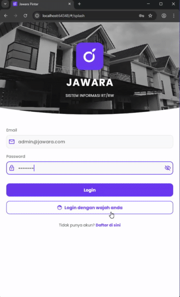
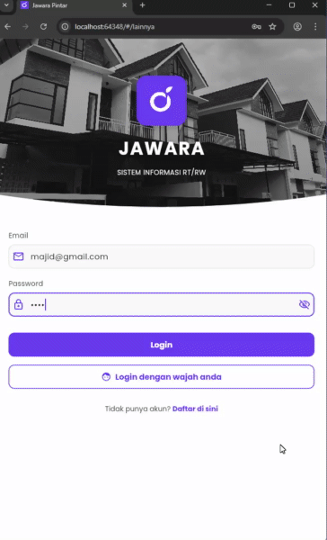
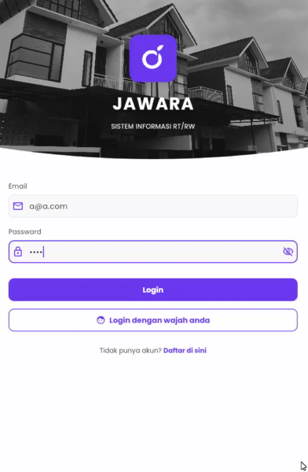

# jawarapbl

`jawarapbl` is a mobile application developed as a mock-up based on a website named "jawara". The application is designed to serve as a digital solution for managing residential data and activities within a community.

---

## Team Contributions

This project was developed collaboratively, with each member responsible for specific modules and features:

### **Anton**

* **Login System** 🔐

* **Dashboard Interface** 🏠

* **Expense Management (Pengeluaran)** 💸

### **Ridho**

* **Resident & Household Data (Data Warga dan Rumah)** 🧾

* **Income Management (Pemasukan)** 💰

* **Activities and Broadcasts (Kegiatan dan Broadcast)** 📢

* **Channel Transfer** 🔄

### **Majid**

* **Financial Reports (Laporan Keuangan)** 📊: 

* **Resident Messages (Pesan Warga)** 💬

* **Resident Admissions (Penerimaan Warga)** 🧍‍♂️: 

### **Hammam**

* **Family Transfers (Mutasi Keluarga)** 👨‍👩‍👧‍👦

* **Activity Logs (Log Aktivitas)** 🧠

* **User Management (Manajemen Pengguna)** ⚙️

# COMPLETE INFORMATION ABOUT THE WORKFLOW OR THE APPLICATION IT SELF CAN BE FOUND IN THE NOTION LINK HERE: https://www.notion.so/PBL-Group-3-Progress-Tracking-2a0f5b3893cf80938bceeafc9996830e?source=copy_link

# EXAMPLE SHOWCASE

