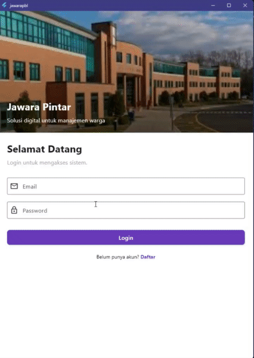
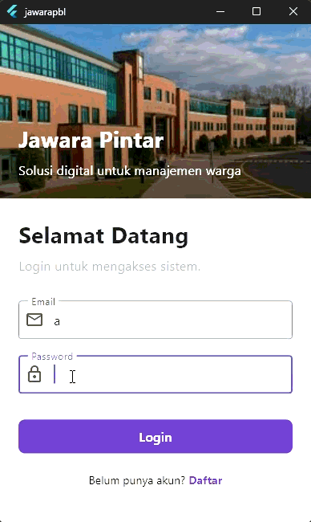
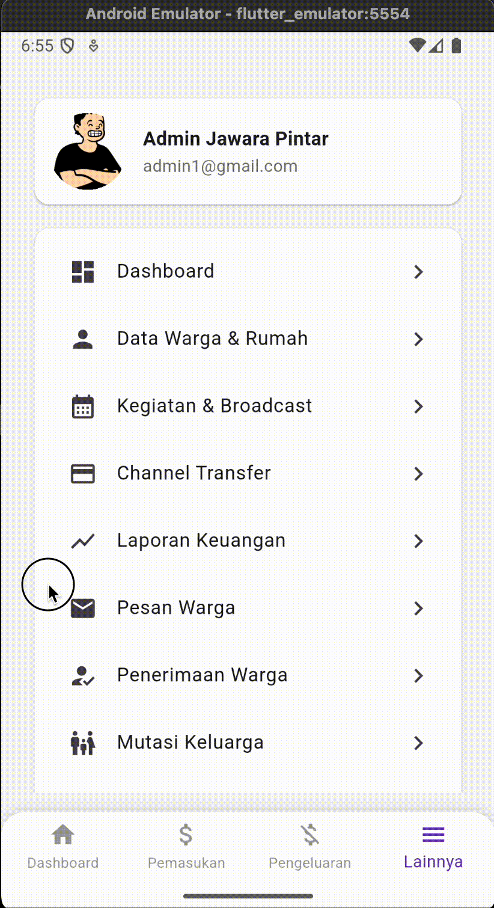
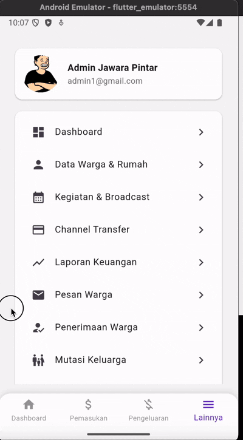

# jawarapbl

`jawarapbl` is a mobile application developed as a mock-up based on a website named "jawara". The application is designed to serve as a digital solution for managing residential data and activities within a community.

---

## Team Contributions

This project was developed collaboratively, with each member responsible for specific modules and features:

### **Anton**

* **Login System** 🔐: Anton developed the authentication system, which includes both login and registration functionalities. This allows users to securely access the application.

* **Dashboard Interface** 🏠: He was responsible for creating the main dashboard, which provides a comprehensive overview of the community's financial, event-related, and demographic data through interactive charts and cards.

* **Expense Management (Pengeluaran)** 💸: Anton also handled the expense management module, enabling users to track and manage all community expenses. This includes functionalities for adding new expenses and viewing a list of all recorded expenditures.

### **Khen**

* **Resident & Household Data (Data Warga dan Rumah)** 🧾: Khen managed the module for resident and household data, which allows for the organized documentation of information about residents, families, and homes within the community.

* **Income Management (Pemasukan)** 💰: He developed the income management system, which tracks various sources of community income, including monthly dues and other contributions.

* **Activities and Broadcasts (Kegiatan dan Broadcast)** 📢: Khen was also in charge of the activities and broadcast feature, which facilitates the sharing of information about community events and important announcements.

* **Channel Transfer** 🔄: He created the channel transfer module, which manages the different payment channels available for financial transactions within the community.

### **Golden**

* **Financial Reports (Laporan Keuangan)** 📊: Golden developed the financial reporting module, which allows users to generate, view, and print detailed financial statements, including income and expense reports.

* **Resident Messages (Pesan Warga)** 💬: He was responsible for the resident messaging system, a feature that enables residents to submit inquiries and aspirations to the community management, with functionalities for viewing, editing, and deleting messages.

* **Resident Admissions (Penerimaan Warga)** 🧍‍♂️: Golden also handled the resident admissions module, which manages the process of registering new residents in the community, including verification and approval of applications.

### **Fahreza**

* **Family Transfers (Mutasi Keluarga)** 👨‍👩‍👧‍👦: Fahreza was in charge of the family transfer module, which tracks changes in family structures within the community, such as relocations, births, and deaths.

* **Activity Logs (Log Aktivitas)** 🧠: He developed the activity logs feature, which records all actions performed within the application for administrative oversight and security purposes.

* **User Management (Manajemen Pengguna)** ⚙️: Fahreza also created the user management module, allowing administrators to add, edit, and remove user accounts and assign roles and permissions.

# GIF Capture of the app (example showcase)

